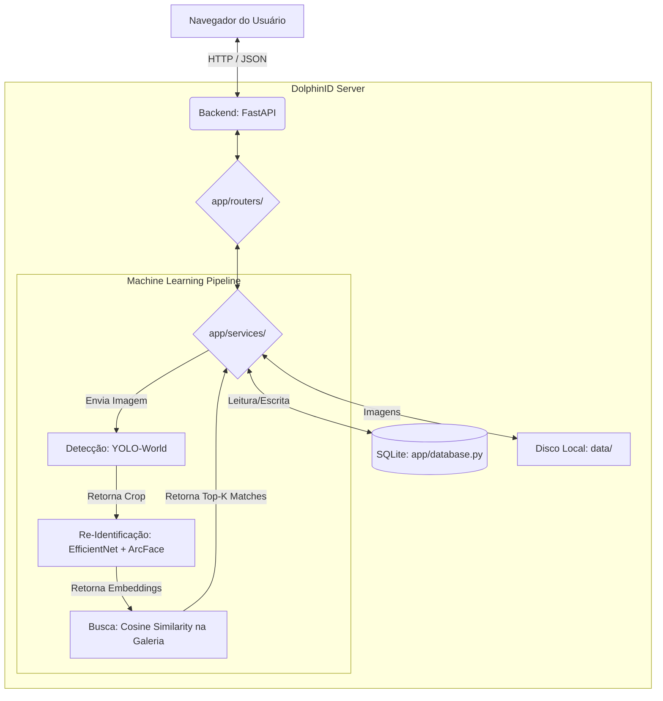

# Arquitetura do Sistema (DolphinID)

Este documento mapeia o fluxo de dados e os principais componentes lógicos da aplicação DolphinID, servindo como guia para entender "como as coisas se conectam".

## 🗺️ Mapa Macro

O DolphinID é estruturado como um monólito clássico local (aplicação cliente servida via um servidor web rodando na própria máquina do usuário). O ecossistema é dividido em três grandes camadas: **Frontend**, **Backend/API** e o **Pipeline de ML**.

## ⚙️ Fluxo de Funcionamento Principal

Quando o usuário processa um lote de imagens, o seguinte pipeline ocorre:

### 1. Ingestão (Ingestion)
- O usuário informa o caminho absoluto para um diretório local contendo imagens de botos.
- O endpoint no backend lê essas imagens, cadastra no banco de dados SQLite (`Session/Image`) para rastreamento de estado.

### 2. Detecção e Corte (Detection & Crop)
- Para cada imagem não processada, o serviço de ML (`app/services/ml_service.py`) carrega o modelo YOLO-World Zero-Shot.
- O YOLO busca as "dorsal fins" e gera caixas delimitadoras (bounding boxes).
- A imagem original é recortada (cropped), e a nova imagem da nadadeira isolada é salva na pasta `data/crops/`.

### 3. Extração de Características (Embeddings)
- O crop da nadadeira passa por redimensionamento e transformações básicas.
- O modelo de Re-Identificação (baseado no módulo em `ml/module.py`, arquitetura EfficientNet-B0 + ArcFace Head) infere a imagem.
- **Saída:** Um vetor latente (embedding) de alta dimensionalidade (ex: 512-d) que representa matematicamente os atributos únicos daquela nadadeira.

### 4. Busca por Similaridade (Matching)
- O embedding extraído é comparado contra um catálogo em memória (a **Galeria**).
- A galeria é composta por embeddings médios ou amostras previamente validadas de todos os botos conhecidos.
- Calculamos a *Cosine Similarity* entre a entrada (query) e as referências (gallery).
- Os indivíduos com maior similaridade são retornados como **Top-K matches** (ex: Top 5).

### 5. Revisão Humana
- Pelo frontend, o usuário visualiza a imagem recortada lado a lado com os *Top-5 matches*.
- O usuário toma a decisão final: "Confirmar identificação" (atualizando o DB) ou "Rejeitar" / registrar "Novo Indivíduo".

## 📦 Gestão de Estado

- O SQLite é responsável por armazenar apenas os metadados das execuções (ID da sessão, caminho da foto local, timestamp, IDs de botos confirmados). As fotos em si continuam morando em disco (FileSystem local).
- O arquivo `.pkl` da Galeria atua como o "Banco de Dados Vetorial" simplificado para consultas em tempo real, sendo carregado em memória RAM via `pickle` no startup do aplicativo.

## 🔗 Extensões (Ex: UMAP Latent Space)
- Como sub-produto do fluxo, o sistema permite a projeção 2D do espaço latente, onde os embeddings de dimensão 512 são reduzidos a 2D (ou 3D) usando o algoritmo UMAP.
- Isso é enviado ao frontend via JSON e plotado com **Plotly.js**, permitindo depurar visualmente como o modelo separa as classes de botos.
