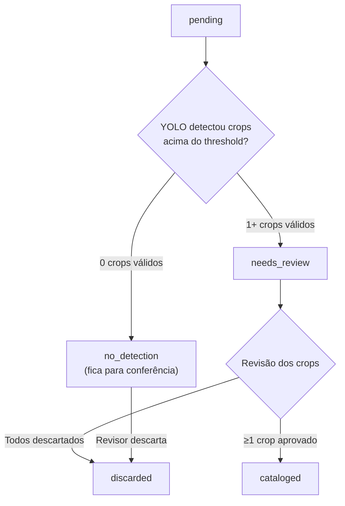
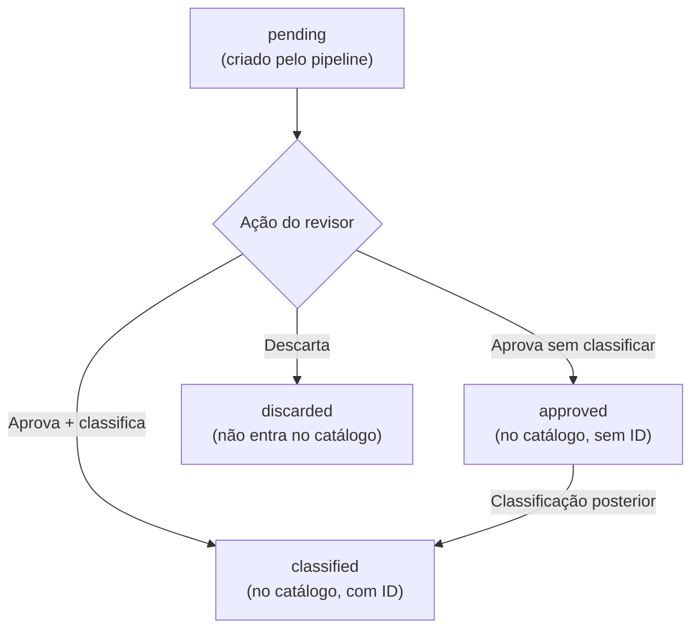
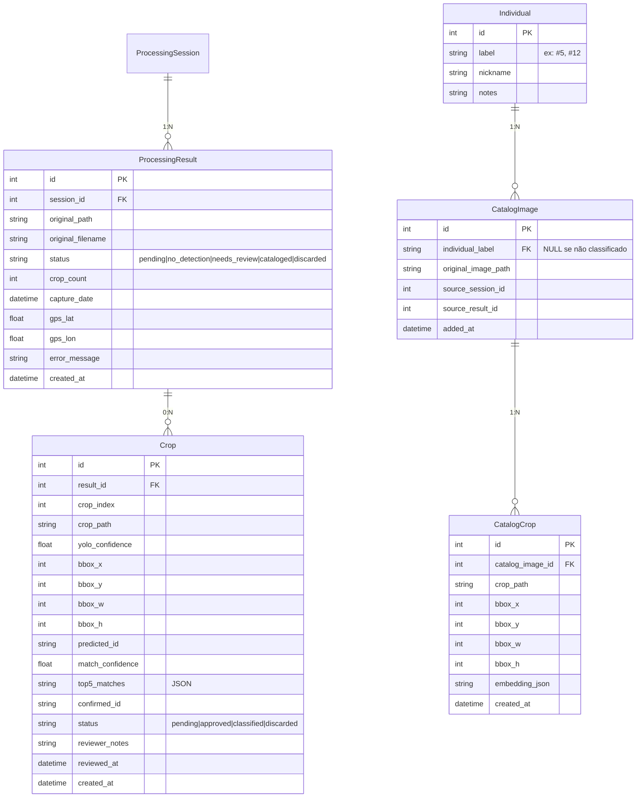

# Evolução do Catálogo: Imagens Originais ↔ Crops — v3

## Decisões Consolidadas

| Questão | Decisão |
|---------|---------|
| Armazenamento de originais | **Opção 3**: copiar apenas quando confirmada para o catálogo |
| Embeddings do PKL | São de **crops** (pipeline: crop→classificar). Cientista precisa da original como referência |
| Múltiplos crops | Aceitos com **threshold mínimo de confiança YOLO**. Cada crop pode ser de indivíduo diferente |
| Escala | ~1500 imagens hoje, máximo ~3000. **FAISS IndexFlatIP** é suficiente |
| Auto-confirm | **Removido**. Todo crop acima do threshold → catálogo como não classificado |
| FAISS rebuild | **Ação manual controlada** no catálogo |

---

## Fluxo de Status Revisado

### Imagem Original (`ProcessingResult`)



### Crop Individual (`Crop`)



> [!IMPORTANT]
> **Mudança-chave vs. versão anterior**: Não há auto-confirm. O pipeline processa e identifica os top-K matches, mas a decisão de aprovar/classificar é **sempre do revisor**. Crops aprovados sem classificação ficam no catálogo como "não classificado" e podem ser classificados posteriormente.

> [!NOTE]
> **Top-K configurável**: O número de matches exibidos na revisão é controlado por `settings.top_k_matches` (padrão: 5). Pode ser ajustado via variável de ambiente `DOLPHIN_ID_TOP_K_MATCHES` — reduzir para 1 caso haja muitos falsos positivos, ou aumentar para ampliar a busca. A UI receberá esse valor via `/api/config` e exibirá dinamicamente.

---

## Design da Tela de Revisão

A tela de revisão pós-processamento precisa suportar dois tipos de ação de forma intuitiva:

### Problema
- **Triagem de crop**: O crop é válido? (aprovar / descartar)
- **Classificação**: De qual indivíduo é este crop? (atribuir ID / deixar sem classificação)

Estes dois passos podem acontecer juntos ou separados, e uma imagem pode ter múltiplos crops de indivíduos diferentes.

### Layout Proposto

```
┌─────────────────────────────────────────────────────────────────┐
│ Resultados da Sessão "Campo Abril 2026"                        │
│ 45 imagens · 12 needs_review · 28 no_detection · 5 cataloged   │
│ [Filtrar: ▾ Todos] [Confiança mínima: ━━━○━━ 0%]              │
├─────────────────────────────────────────────────────────────────┤
│                                                                 │
│  ┌──────────────────────────────────────────────────────────┐   │
│  │ 📸 IMG_2045.jpg                    [needs_review] 2 crops│   │
│  │ ┌──────────┐  ┌──────────────────────────────────────┐   │   │
│  │ │          │  │ Crop 1 (YOLO: 92%)     [pending]     │   │   │
│  │ │ Imagem   │  │ ┌────┐ Predição: #5 (87%)           │   │   │
│  │ │ original │  │ │crop│ Top-5: #5 87% · #12 72% · ...│   │   │
│  │ │ (thumb)  │  │ │ 1  │                               │   │   │
│  │ │          │  │ └────┘ [✅ Aprovar como #5]           │   │   │
│  │ │ clique   │  │        [✅ Aprovar sem classificar]   │   │   │
│  │ │ p/ ver   │  │        [🔄 Outro ID...] [❌ Descartar]│   │   │
│  │ │ ampliada │  ├──────────────────────────────────────┤   │   │
│  │ │          │  │ Crop 2 (YOLO: 45%)     [pending]     │   │   │
│  │ │          │  │ ┌────┐ Predição: #8 (62%)           │   │   │
│  │ │          │  │ │crop│ Top-5: #8 62% · #3 55% · ...│   │   │
│  │ │          │  │ │ 2  │                               │   │   │
│  │ │          │  │ └────┘ [✅ Aprovar como #8]           │   │   │
│  │ │          │  │        [✅ Aprovar sem classificar]   │   │   │
│  │ │          │  │        [🔄 Outro ID...] [❌ Descartar]│   │   │
│  │ └──────────┘  └──────────────────────────────────────┘   │   │
│  └──────────────────────────────────────────────────────────┘   │
│                                                                 │
│  ┌──────────────────────────────────────────────────────────┐   │
│  │ 📸 IMG_2046.jpg                    [needs_review] 1 crop │   │
│  │ ┌──────────┐  ┌──────────────────────────────────────┐   │   │
│  │ │ Imagem   │  │ Crop 1 (YOLO: 88%)     [pending]     │   │   │
│  │ │ original │  │ ┌────┐ Predição: #12 (91%)          │   │   │
│  │ │ (thumb)  │  │ │crop│ Top-5: #12 91% · #5 68%· ... │   │   │
│  │ │          │  │ │ 1  │                               │   │   │
│  │ │          │  │ └────┘ [✅ Aprovar como #12]          │   │   │
│  │ │          │  │        [✅ Aprovar sem classificar]   │   │   │
│  │ │          │  │        [🔄 Outro ID...] [❌ Descartar]│   │   │
│  │ └──────────┘  └──────────────────────────────────────┘   │   │
│  └──────────────────────────────────────────────────────────┘   │
│                                                                 │
│  ┌──────────────────────────────────────────────────────────┐   │
│  │ 📸 IMG_2047.jpg                    [no_detection]        │   │
│  │ ┌──────────┐  Nenhum crop detectado.                     │   │
│  │ │ Imagem   │  [❌ Descartar imagem]                      │   │
│  │ │ original │                                              │   │
│  │ └──────────┘                                              │   │
│  └──────────────────────────────────────────────────────────┘   │
└─────────────────────────────────────────────────────────────────┘
```

### Ações Disponíveis por Crop

| Ação | Efeito | Status do Crop |
|------|--------|----------------|
| **Aprovar como \<ID\>** | Aceita a predição do modelo ou match do top-5 | `classified` |
| **Aprovar sem classificar** | Crop válido, mas sem ID definido | `approved` |
| **Outro ID...** | Prompt para digitar ID manualmente → aprova + classifica | `classified` |
| **Descartar** | Crop inválido, não entra no catálogo | `discarded` |

### Lógica de Atualização do `ProcessingResult`

Após cada ação em um crop, verificar:
```python
crops = get_crops_for_result(result_id)
all_resolved = all(c.status != 'pending' for c in crops)
any_approved = any(c.status in ('approved', 'classified') for c in crops)

if all_resolved:
    if any_approved:
        result.status = 'cataloged'
    else:
        result.status = 'discarded'
```

### Modal da Imagem Original

Ao clicar na imagem original no card, abre modal com:
- Imagem em tamanho maior
- Bounding boxes dos crops sobrepostos (coloridos por status)
- Legenda: verde = aprovado, amarelo = pendente, vermelho = descartado

---

## Estratégia de Rebuild do FAISS

### Decisão: Ação Manual Controlada

O FAISS index **não é atualizado automaticamente** após cada confirmação. Em vez disso:

1. **Botão "Reconstruir Índice"** visível no cabeçalho do Catálogo (galeria)
2. Quando clicado:
   - Coleta todos os `CatalogCrop.embedding_json` do banco
   - Reconstrói o `IndexFlatIP` do zero
   - Salva no disco
   - Mostra toast com resultado: "Índice reconstruído: 1523 embeddings de 42 indivíduos"
3. **Indicador visual** mostra quando há crops no catálogo que ainda não estão no índice
   - Ex: "⚠️ 15 novos crops desde a última indexação"

### Endpoints

```
POST /api/gallery/rebuild-index
  → Reconstrói FAISS a partir do DB
  → Retorna: { "total_embeddings": 1523, "total_individuals": 42 }

GET /api/gallery/index-status
  → Retorna: { "indexed": 1500, "pending": 23, "needs_rebuild": true }
```

### Justificativa

- O cientista tem controle sobre quando o índice é atualizado
- Evita rebuilds parciais que poderiam gerar inconsistências
- Na escala de ~3000 embeddings, o rebuild é rápido (< 1s)
- Clareza: "o que eu confirmei desde o último rebuild ainda não está no índice"

---

## Modelo de Dados Atualizado



> [!NOTE]
> `CatalogImage.individual_label` pode ser `NULL` — isso representa imagens no catálogo que ainda não foram classificadas para um indivíduo específico. Elas aparecem no catálogo numa seção "Não classificados".

---

## Fases de Implementação

### Fase 1: Modelo de Dados

| Arquivo | Ação | Descrição |
|---------|------|-----------|
| [result.py](file:///C:/Users/alban/OneDrive/Documentos/Projeto%20Udesc/pesquisa/dolphin-id/app/models/result.py) | MODIFY | Separar em `ProcessingResult` + `Crop` |
| [catalog.py](file:///C:/Users/alban/OneDrive/Documentos/Projeto%20Udesc/pesquisa/dolphin-id/app/models/catalog.py) | NEW | `CatalogImage` + `CatalogCrop` |
| [individual.py](file:///C:/Users/alban/OneDrive/Documentos/Projeto%20Udesc/pesquisa/dolphin-id/app/models/individual.py) | MODIFY | Remover `total_gallery_images` |
| [config.py](file:///C:/Users/alban/OneDrive/Documentos/Projeto%20Udesc/pesquisa/dolphin-id/app/config.py) | MODIFY | Novo `yolo_crop_min_confidence`, dirs de catálogo |
| [database.py](file:///C:/Users/alban/OneDrive/Documentos/Projeto%20Udesc/pesquisa/dolphin-id/app/database.py) | MODIFY | Registrar novos modelos |

### Fase 2: Pipeline + Serviços

| Arquivo | Ação | Descrição |
|---------|------|-----------|
| [pipeline.py](file:///C:/Users/alban/OneDrive/Documentos/Projeto%20Udesc/pesquisa/dolphin-id/app/services/pipeline.py) | MODIFY | Criar múltiplos `Crop`, filtrar por threshold, sem auto-confirm |
| [gallery.py](file:///C:/Users/alban/OneDrive/Documentos/Projeto%20Udesc/pesquisa/dolphin-id/app/services/gallery.py) | MODIFY | `import_from_pkl()`, `add_to_catalog()`, `rebuild_index_from_db()` |

### Fase 3: Rotas (API)

| Arquivo | Ação | Descrição |
|---------|------|-----------|
| [results.py](file:///C:/Users/alban/OneDrive/Documentos/Projeto%20Udesc/pesquisa/dolphin-id/app/routers/results.py) | MODIFY | Endpoints por crop: confirm, approve, reject, discard |
| [sessions.py](file:///C:/Users/alban/OneDrive/Documentos/Projeto%20Udesc/pesquisa/dolphin-id/app/routers/sessions.py) | MODIFY | Results com crops aninhados |
| [gallery.py](file:///C:/Users/alban/OneDrive/Documentos/Projeto%20Udesc/pesquisa/dolphin-id/app/routers/gallery.py) | MODIFY | Catálogo por imagens originais, rebuild-index, index-status |

### Fase 4: Frontend

| Arquivo | Ação | Descrição |
|---------|------|-----------|
| [results.js](file:///C:/Users/alban/OneDrive/Documentos/Projeto%20Udesc/pesquisa/dolphin-id/app/static/js/results.js) | MODIFY | Nova tela de revisão com original + crops |
| [gallery.js](file:///C:/Users/alban/OneDrive/Documentos/Projeto%20Udesc/pesquisa/dolphin-id/app/static/js/gallery.js) | MODIFY | Catálogo por originais, rebuild button, UMAP link para original |

### Fase 5: Migração

| Arquivo | Ação | Descrição |
|---------|------|-----------|
| [setup_artifacts.py](file:///C:/Users/alban/OneDrive/Documentos/Projeto%20Udesc/pesquisa/dolphin-id/scripts/setup_artifacts.py) | MODIFY | Chamar `import_from_pkl()` |
| [main.py](file:///C:/Users/alban/OneDrive/Documentos/Projeto%20Udesc/pesquisa/dolphin-id/app/main.py) | MODIFY | Auto-import PKL se DB vazio no startup |

---

## Cenários de Teste

### T1: Pipeline — Imagem sem detecção

| Item | Detalhe |
|------|---------|
| **Pré-condição** | Imagem sem nadadeira dorsal visível |
| **Ação** | Processar via pipeline |
| **Resultado esperado** | `ProcessingResult.status = 'no_detection'`, `crop_count = 0`, nenhum `Crop` criado |
| **Verificação** | API `GET /sessions/{id}/results` retorna resultado com `crops: []` |

### T2: Pipeline — Imagem com 1 crop acima do threshold

| Item | Detalhe |
|------|---------|
| **Pré-condição** | Imagem com 1 nadadeira, YOLO confiança > `yolo_crop_min_confidence` |
| **Ação** | Processar via pipeline |
| **Resultado esperado** | `ProcessingResult.status = 'needs_review'`, `crop_count = 1`, 1 `Crop` com `status = 'pending'`, `predicted_id` e `top5_matches` preenchidos |
| **Verificação** | Crop file existe em `data/crops/{session_id}/`, API retorna crop com matches |

### T3: Pipeline — Imagem com múltiplos crops

| Item | Detalhe |
|------|---------|
| **Pré-condição** | Imagem com 2+ nadadeiras visíveis |
| **Ação** | Processar via pipeline |
| **Resultado esperado** | `crop_count = N`, N `Crop`s criados, todos `pending`, cada um com sua bbox e predição |
| **Verificação** | Cada crop tem `crop_index` sequencial, bboxes não se sobrepõem excessivamente |

### T4: Pipeline — Crop abaixo do threshold YOLO

| Item | Detalhe |
|------|---------|
| **Pré-condição** | YOLO detecta algo com confiança < `yolo_crop_min_confidence` |
| **Ação** | Processar via pipeline |
| **Resultado esperado** | Crop NÃO é salvo. Se era a única detecção, `status = 'no_detection'` |
| **Verificação** | Nenhum arquivo de crop criado para essa detecção, nenhum `Crop` no DB |

### T5: Pipeline — Mix de crops válidos e inválidos

| Item | Detalhe |
|------|---------|
| **Pré-condição** | Imagem com 3 detecções: 2 acima e 1 abaixo do threshold |
| **Ação** | Processar via pipeline |
| **Resultado esperado** | `crop_count = 2`, apenas 2 `Crop`s criados, `status = 'needs_review'` |
| **Verificação** | Não existe crop com baixa confiança no DB ou disco |

### T6: Revisão — Aprovar crop com classificação (top-5)

| Item | Detalhe |
|------|---------|
| **Pré-condição** | Crop pendente com `predicted_id = '#5'` e `match_confidence = 0.87` |
| **Ação** | Clicar "Aprovar como #5" |
| **Resultado esperado** | `Crop.status = 'classified'`, `confirmed_id = '#5'`, `CatalogImage` e `CatalogCrop` criados, imagem original copiada para catálogo |
| **Verificação** | Catálogo mostra nova imagem sob indivíduo #5, arquivo original existe em `catalog/originals/#5/` |

### T7: Revisão — Aprovar crop sem classificar

| Item | Detalhe |
|------|---------|
| **Pré-condição** | Crop pendente |
| **Ação** | Clicar "Aprovar sem classificar" |
| **Resultado esperado** | `Crop.status = 'approved'`, `CatalogImage` criada com `individual_label = NULL`, imagem copiada para catálogo |
| **Verificação** | Catálogo mostra imagem na seção "Não classificados" |

### T8: Revisão — Aprovar crop com ID manual

| Item | Detalhe |
|------|---------|
| **Pré-condição** | Crop pendente, modelo sugeriu #5 mas é na verdade #8 |
| **Ação** | Clicar "Outro ID...", digitar "#8" |
| **Resultado esperado** | `Crop.status = 'classified'`, `confirmed_id = '#8'` |
| **Verificação** | Catálogo mostra sob #8, não #5. Se #8 não existia, `Individual` é criado |

### T9: Revisão — Descartar crop

| Item | Detalhe |
|------|---------|
| **Pré-condição** | Crop pendente (detecção falsa, ex: onda confundida com nadadeira) |
| **Ação** | Clicar "Descartar" |
| **Resultado esperado** | `Crop.status = 'discarded'`. Se era o único crop, `ProcessingResult.status = 'discarded'` |
| **Verificação** | Nenhuma entrada no catálogo. Crop continua existindo no DB (para auditoria) mas não entra no catálogo |

### T10: Revisão — Múltiplos crops, ações mistas

| Item | Detalhe |
|------|---------|
| **Pré-condição** | Imagem com 2 crops pendentes |
| **Ação** | Aprovar crop 1 como #5, descartar crop 2 |
| **Resultado esperado** | Após ambas as ações: `ProcessingResult.status = 'cataloged'` (pelo menos 1 aprovado) |
| **Verificação** | Apenas 1 `CatalogImage` criada, associada a #5 |

### T11: Revisão — Múltiplos crops, indivíduos diferentes

| Item | Detalhe |
|------|---------|
| **Pré-condição** | Imagem com 2 crops, cada um de um indivíduo diferente |
| **Ação** | Aprovar crop 1 como #5, aprovar crop 2 como #12 |
| **Resultado esperado** | 1 `CatalogImage` para #5, 1 `CatalogImage` para #12 (mesma original, copiada 1x). Cada uma com seu `CatalogCrop` |
| **Verificação** | Catálogo mostra imagem tanto em #5 quanto em #12 |

### T12: Revisão — Descartar imagem sem detecção

| Item | Detalhe |
|------|---------|
| **Pré-condição** | Imagem com `status = 'no_detection'` |
| **Ação** | Clicar "Descartar imagem" |
| **Resultado esperado** | `ProcessingResult.status = 'discarded'` |
| **Verificação** | Imagem não aparece mais na lista de revisão pendente |

### T13: Catálogo — Visualizar indivíduo com imagens originais

| Item | Detalhe |
|------|---------|
| **Pré-condição** | Indivíduo #5 com 3 `CatalogImage`s, cada uma com 1 `CatalogCrop` |
| **Ação** | Navegar para `#/gallery/individual?label=#5` |
| **Resultado esperado** | Grid com 3 imagens originais. Cada card mostra badge "1 crop" |
| **Verificação** | Ao clicar, lightbox mostra original com opção de ver crop associado |

### T14: Catálogo — Seção "Não classificados"

| Item | Detalhe |
|------|---------|
| **Pré-condição** | 5 `CatalogImage`s com `individual_label = NULL` |
| **Ação** | Navegar para galeria |
| **Resultado esperado** | Seção separada "Não classificados" com 5 imagens |
| **Verificação** | Cada imagem pode ser classificada a posteriori via UI |

### T15: Catálogo — Reconstruir índice FAISS

| Item | Detalhe |
|------|---------|
| **Pré-condição** | 10 novos `CatalogCrop`s desde o último rebuild |
| **Ação** | Clicar "Reconstruir Índice" |
| **Resultado esperado** | FAISS reconstruído com todos os embeddings do DB. Indicador "⚠️ 10 novos" desaparece |
| **Verificação** | `GET /api/gallery/index-status` retorna `needs_rebuild: false` |

### T16: UMAP — Clicar ponto e ver original

| Item | Detalhe |
|------|---------|
| **Pré-condição** | Catálogo indexado com UMAP computado |
| **Ação** | Clicar em um ponto no UMAP |
| **Resultado esperado** | Modal mostra o crop (que foi vetorizado). Botão "Ver imagem original" abre a imagem completa |
| **Verificação** | Link funciona corretamente para imagens importadas do PKL e para imagens adicionadas via revisão |

### T17: Importação PKL → Catálogo

| Item | Detalhe |
|------|---------|
| **Pré-condição** | PKL existente com ~1500 entries, DB de catálogo vazio |
| **Ação** | Startup da aplicação ou `setup_artifacts.py` |
| **Resultado esperado** | `Individual`, `CatalogImage`, `CatalogCrop` criados para cada entry. FAISS index construído |
| **Verificação** | `GET /api/gallery/individuals` lista todos os indivíduos do PKL. UMAP funciona |

### T18: Classificação posterior no catálogo

| Item | Detalhe |
|------|---------|
| **Pré-condição** | `CatalogImage` não classificada (da seção "Não classificados") |
| **Ação** | Atribuir a um indivíduo via UI do catálogo |
| **Resultado esperado** | `CatalogImage.individual_label` atualizado. Imagem move de "Não classificados" para o indivíduo |
| **Verificação** | Galeria reflete a mudança. Contagem atualizada |

---

## Observações de Implementação

> [!TIP]
> **CatalogImage compartilhada**: Quando uma imagem original tem 2 crops de indivíduos diferentes (#5 e #12), criamos **2 CatalogImages** (uma para cada indivíduo), mas a imagem original é copiada apenas 1 vez para o disco. As 2 CatalogImages referenciam o mesmo arquivo.

> [!TIP]
> **Crop descartado vs. não criado**: Crops abaixo do threshold YOLO **nunca são criados** (T4). Crops criados mas descartados pelo revisor (T9) **permanecem no DB** com `status = 'discarded'` para fins de auditoria, mas não geram entradas no catálogo.

> [!WARNING]
> **Migração de dados**: Sessões processadas antes desta mudança terão resultados no formato antigo (sem tabela `Crop` separada). A migration deve criar `Crop` entries a partir dos campos existentes em `ProcessingResult` para manter compatibilidade.
